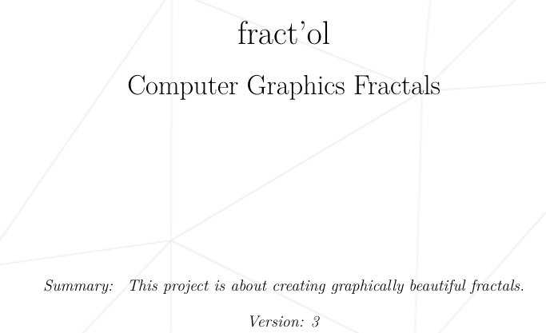
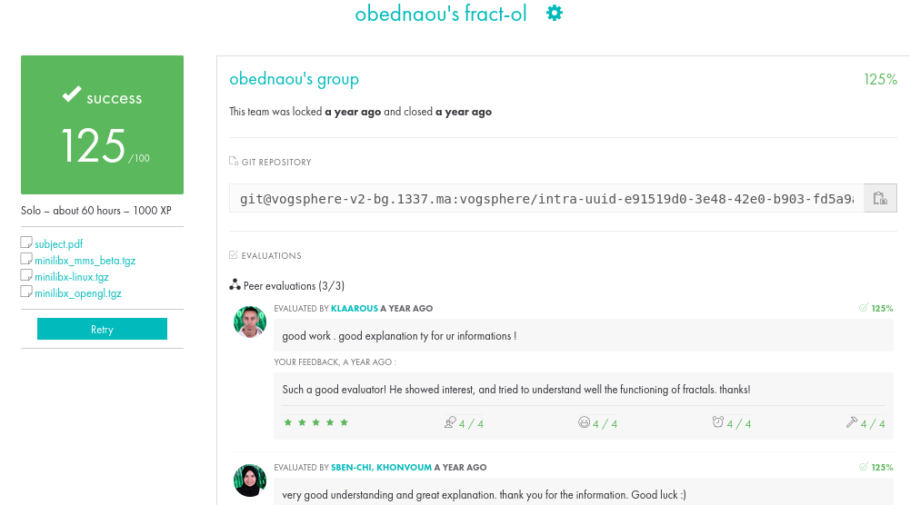

# 42_FRACTAL

## About

This project aims to create visually striking fractals such as the Mandelbrot and Julia sets. It was my first adventure in graphics projects of the 42 common core curriculum. Here is the link to the [subject](https://cdn.intra.42.fr/pdf/pdf/121932/en.subject.pdf)



## Julia Set Preview:

https://github.com/Stilram19/fractal/assets/115463108/75be481e-1ec3-4c78-8102-b8df0529d8bd

## What I learned from this project:

During the development of this project, I've learned several important concepts including:

- **PixelPixel and image memory representation**: Understanding how pixels and
images are stored in memory, crucial for manipulating graphical data, since the project is about coloring an image putting pixel by pixel. 
- **User input Handling (through Mouse, keyboard)**: During the project, I implementated zooming and translation functionalities through both mouse and keyboard events. This involved understanding how to interpret user input, such as mouse wheel scrolling or keyboard arrow keys, to adjust the viewport and manipulate the displayed fractal accordingly. This added an interactive dimension to the project, allowing users to explore fractals dynamically and focus on specific regions of interest with ease.
- **Mathematical transformations for fractal generation**: Applying mathematical transformations to generate fractal patterns and structures.
- **Performance optimization in rendering**: Enhancing rendering speed and efficiency to manage computationally intensive fractal calculations by minimizing overhead. For instance, optimizing resource usage by consolidating crucial information into a single global structure stored in the data segment, thus streamlining access and reducing processing time.
- **Coordinate systems and transformations**: Understanding coordinate systems and transformations to map fractal space onto the screen.
- **Debugging and troubleshooting graphical applications**: Identifying and
resolving issues in graphical programs, ensuring smooth operation.

# my_42_project



## Installation and Usage

This project was built first time in mac, using the mlx 42 libarary (macos version), but was translated to SDL since the linux mlx version isn't responding to user input (Keyboard, Mouse).

1. Install SDL:
   ```bash
      sudo apt update && sudo apt install libsdl2-dev libsdl2-image-dev
   ```

2. Clone the repository to your local machine:

   ```bash
   git clone git@github.com:Stilram19/fractal.git
   ```

3. Navigate to the repository's directory:

    ```bash
    cd fractal
    ```

3. Compile and Run the program:
   To make the program render Julia Set (Move the mouse and let the magic happen):
   ``` bash
   make julia
   ```

   To make the program render Mandlbrot Set:
   ``` bash
   make mandelbrot
   ```

## Concepts you cannot do without (for students):

- [image memory representation](https://youtu.be/8CuYq3RU7BY?si=4uNmKBcBs7NfgL5R)
- [RGB coloring model](https://en.wikipedia.org/wiki/RGB_color_model)
- [fractal](https://en.wikipedia.org/wiki/Fractal)
- [Basics of Complex Numbers](https://en.wikipedia.org/wiki/Complex_number)
- [Mandelbrot Set](https://en.wikipedia.org/wiki/Mandelbrot_set)
- [Julia Set](https://en.wikipedia.org/wiki/Julia_set)
- [Julia Set](https://en.wikipedia.org/wiki/Julia_set)
- [Computer Graphics](https://en.wikipedia.org/wiki/Computer_graphics_(computer_science))
